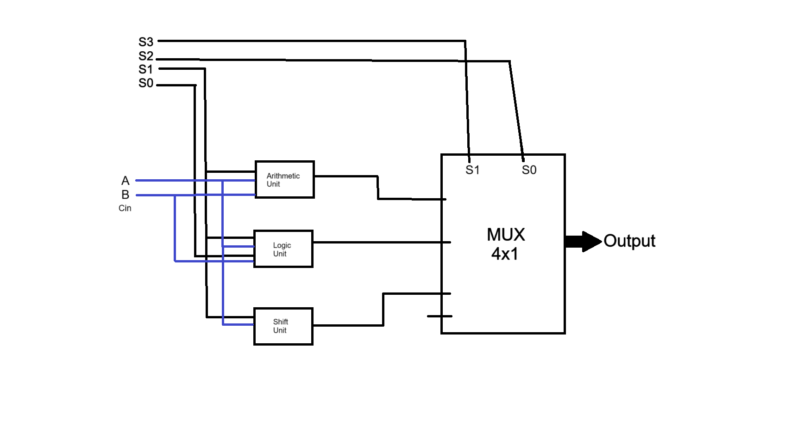
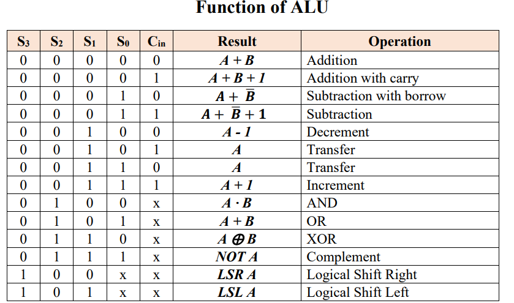

# 8-Bit-ALU-System
Final Project for "503323-3 | Computer Architecture Course in Taif University"

## The prinary course repository (Introduction)
You can see a repository an introduction for the course and project from this [Link](https://github.com/Saad711T/ComputerArchitecture)

## Diagram

##### Diagram

##### Function table

### Notice :
I'm not really intrested in computer engineering and computer architecture , But this for required project for course in university.
#### Credits
*By : 0xSaad / Saad Almalki*
